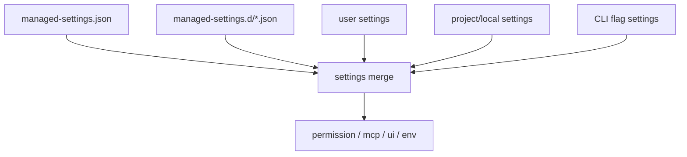

相关源文件

生成本页时使用的主要源文件：

- [package.json](../../../project-repos/claude-code/package.json)
- [bunfig.toml](../../../project-repos/claude-code/bunfig.toml)
- [tsconfig.json](../../../project-repos/claude-code/tsconfig.json)
- [src/utils/settings/settings.ts](../../../project-repos/claude-code/src/utils/settings/settings.ts)
- [src/services/mcp/config.ts](../../../project-repos/claude-code/src/services/mcp/config.ts)
- [src/migrations/migrateAutoUpdatesToSettings.ts](../../../project-repos/claude-code/src/migrations/migrateAutoUpdatesToSettings.ts)
- [src/services/analytics/growthbook.ts](../../../project-repos/claude-code/src/services/analytics/growthbook.ts)

# 配置、构建与质量门禁

配置层服务的是可控启动，而不是简单读取 JSON。源码把 policy/user/project/local/flag settings 分层处理，托管设置还支持 drop-in 目录按文件名顺序合并。MCP 配置写入 `.mcp.json` 时保留权限、写临时文件、datasync、再 rename，失败时只清理明确的 temp 文件。

Sources: [src/utils/settings/settings.ts:55-121](../../../project-repos/pages/src/utils/settings/settings.ts#L55-L121), [src/utils/settings/settings.ts:172-231](../../../project-repos/pages/src/utils/settings/settings.ts#L172-L231), [src/utils/settings/settings.ts:233-260](../../../project-repos/pages/src/utils/settings/settings.ts#L233-L260)

引用源码

<!-- source-snippets:start -->

#### `src/utils/settings/settings.ts:55-121`

> 未找到引用文件：`src/utils/settings/settings.ts`

#### `src/utils/settings/settings.ts:172-231`

> 未找到引用文件：`src/utils/settings/settings.ts`

#### `src/utils/settings/settings.ts:233-260`

> 未找到引用文件：`src/utils/settings/settings.ts`

<!-- source-snippets:end -->

## MCP 写配置采用原子替换

`writeMcpjsonFile()` 会读取现有 `.mcp.json` 权限，写入带 pid/time 的临时文件，`datasync()` 后再 `rename()`。如果 rename 失败，只 unlink 那个明确 temp path；这保证不会批量清理目录，也降低写坏配置的概率。

Sources: [src/services/mcp/config.ts:83-131](../../../project-repos/pages/src/services/mcp/config.ts#L83-L131)

引用源码

<!-- source-snippets:start -->

#### `src/services/mcp/config.ts:83-131`

> 未找到引用文件：`src/services/mcp/config.ts`

<!-- source-snippets:end -->

## 构建脚本依赖 Bun 的 define 注入

`package.json` 的 build 命令使用 `bun build src/entrypoints/cli.tsx --target bun`，同时注入 `MACRO.VERSION`、`MACRO.BUILD_TIME`、`MACRO.PACKAGE_URL` 等编译期常量。README 也说明 `bun:bundle` feature flag 会通过本地 plugin shim 让未启用代码默认 false。

Sources: [package.json:7-12](../../../project-repos/pages/package.json#L7-L12), [README.md:62-67](../../../project-repos/pages/README.md#L62-L67)

引用源码

<!-- source-snippets:start -->

#### `package.json:7-12`

> 未找到引用文件：`package.json`

#### `README.md:62-67`

> 未找到引用文件：`README.md`

<!-- source-snippets:end -->

## 质量门禁以 TypeScript 为主

仓库脚本只暴露 `typecheck`，测试文件非常少；这意味着可验证质量主要依赖 TypeScript strict、schema 校验、局部运行时保护和大量 feature gate 分支。对于读者来说，理解 `buildTool` 的默认值、settings schema 和 permission rule 过滤，比寻找传统单元测试更能解释项目可靠性边界。

Sources: [package.json:7-12](../../../project-repos/pages/package.json#L7-L12), [package.json:87-102](../../../project-repos/pages/package.json#L87-L102), [src/Tool.ts:743-792](../../../project-repos/pages/src/Tool.ts#L743-L792), [src/utils/settings/settings.ts:213-227](../../../project-repos/pages/src/utils/settings/settings.ts#L213-L227)

引用源码

<!-- source-snippets:start -->

#### `package.json:7-12`

> 未找到引用文件：`package.json`

#### `package.json:87-102`

> 未找到引用文件：`package.json`

#### `src/Tool.ts:743-792`

> 未找到引用文件：`src/Tool.ts`

#### `src/utils/settings/settings.ts:213-227`

> 未找到引用文件：`src/utils/settings/settings.ts`

<!-- source-snippets:end -->

## 相关页面

- [启动与 CLI 入口](startup-and-cli.md) — 配置在 preAction 和 action 中生效
- [权限与 Hook](permissions-hooks.md) — 权限规则来源于 settings
- [MCP 集成](mcp-integration.md) — MCP server 配置也受 settings 策略控制
