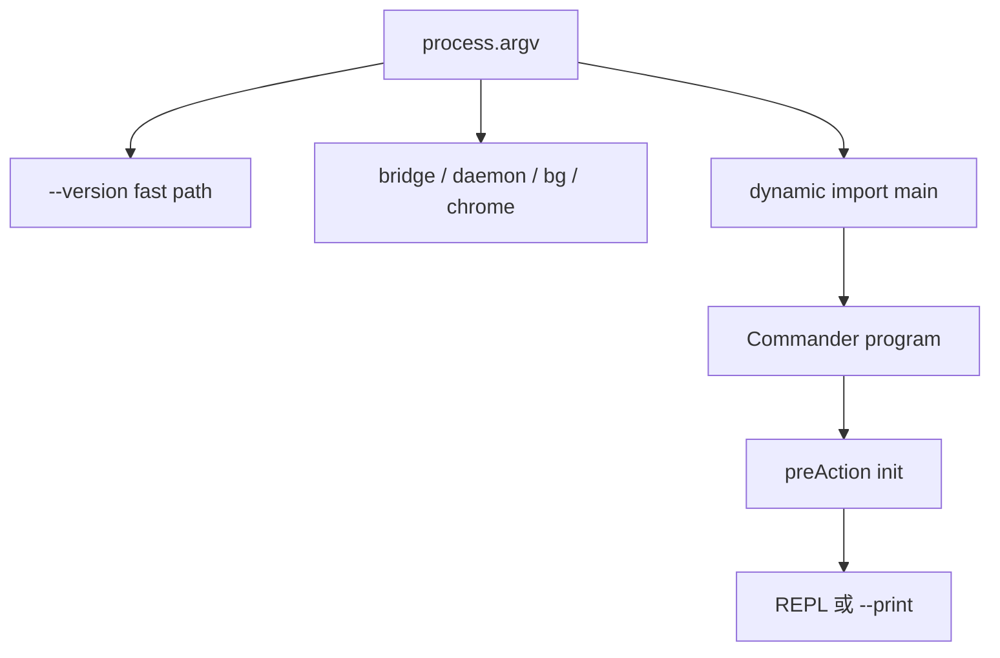

相关源文件

生成本页时使用的主要源文件：

- [src/entrypoints/cli.tsx](../../../project-repos/claude-code/src/entrypoints/cli.tsx)
- [src/main.tsx](../../../project-repos/claude-code/src/main.tsx)
- [package.json](../../../project-repos/claude-code/package.json)
- [plugins/bunBundleDev.ts](../../../project-repos/claude-code/plugins/bunBundleDev.ts)
- [bunfig.toml](../../../project-repos/claude-code/bunfig.toml)

# 启动与 CLI 入口

启动层有两个目标：让常见路径尽量少加载模块，同时在真正进入会话前把配置、策略、遥测和远程能力准备好。`src/entrypoints/cli.tsx` 做快速分流，`--version` 这类路径不加载完整 CLI；普通路径再动态导入启动 profiler 和 `main.tsx`。

Sources: [src/entrypoints/cli.tsx:28-42](../../../project-repos/pages/src/entrypoints/cli.tsx#L28-L42), [src/entrypoints/cli.tsx:44-71](../../../project-repos/pages/src/entrypoints/cli.tsx#L44-L71), [src/entrypoints/cli.tsx:72-93](../../../project-repos/pages/src/entrypoints/cli.tsx#L72-L93), [src/entrypoints/cli.tsx:108-180](../../../project-repos/pages/src/entrypoints/cli.tsx#L108-L180), [package.json:7-12](../../../project-repos/pages/package.json#L7-L12)

引用源码

<!-- source-snippets:start -->

#### `src/entrypoints/cli.tsx:28-42`

> 未找到引用文件：`src/entrypoints/cli.tsx`

#### `src/entrypoints/cli.tsx:44-71`

> 未找到引用文件：`src/entrypoints/cli.tsx`

#### `src/entrypoints/cli.tsx:72-93`

> 未找到引用文件：`src/entrypoints/cli.tsx`

#### `src/entrypoints/cli.tsx:108-180`

> 未找到引用文件：`src/entrypoints/cli.tsx`

#### `package.json:7-12`

> 未找到引用文件：`package.json`

<!-- source-snippets:end -->

## preAction 是真实初始化阀门

`main.tsx` 没有在注册 Commander 时立刻初始化全部系统，而是把初始化挂到 `preAction`。这能让 `--help` 等路径避开重配置，同时保证实际命令执行前完成 MDM/keychain、`init()`、日志 sink、插件目录、迁移、远程托管设置和 policy limits。

Sources: [src/main.tsx:884-968](../../../project-repos/pages/src/main.tsx#L884-L968)

引用源码

<!-- source-snippets:start -->

#### `src/main.tsx:884-968`

> 未找到引用文件：`src/main.tsx`

<!-- source-snippets:end -->

## print 模式绕开子命令注册

一个不太显眼但重要的性能选择是：`-p/--print` 模式会跳过大量子命令注册。代码注释直接给出原因：mcp/auth/plugin/doctor/update 等 50 多个子命令注册路径会带来启动成本，而 print 模式只需要默认 action。

Sources: [src/main.tsx:3873-3890](../../../project-repos/pages/src/main.tsx#L3873-L3890)

引用源码

<!-- source-snippets:start -->

#### `src/main.tsx:3873-3890`

> 未找到引用文件：`src/main.tsx`

<!-- source-snippets:end -->

## CLI 不是单一入口，而是一组运行模式

主命令之外，源码还保留 server、ssh、open/connect、remote-control 等路径。`server` 会启动 session server、写 lockfile 并托管 session manager；`ssh` 则通过早期 argv rewriting 进入远程部署/隧道流程。这说明 CLI 被设计成可交互终端、headless 子进程、远程控制端和 session server 的共同外壳。

Sources: [src/main.tsx:3960-4037](../../../project-repos/pages/src/main.tsx#L3960-L4037), [src/main.tsx:4040-4052](../../../project-repos/pages/src/main.tsx#L4040-L4052), [src/main.tsx:3810-3869](../../../project-repos/pages/src/main.tsx#L3810-L3869)

引用源码

<!-- source-snippets:start -->

#### `src/main.tsx:3960-4037`

> 未找到引用文件：`src/main.tsx`

#### `src/main.tsx:4040-4052`

> 未找到引用文件：`src/main.tsx`

#### `src/main.tsx:3810-3869`

> 未找到引用文件：`src/main.tsx`

<!-- source-snippets:end -->

## 相关页面

- [项目概览](overview.md) — 先建立整体结构
- [QueryEngine 会话运行时](query-runtime.md) — 启动之后进入的会话核心
- [配置、构建与质量门禁](settings-build-quality.md) — 启动读取的配置和构建方式
