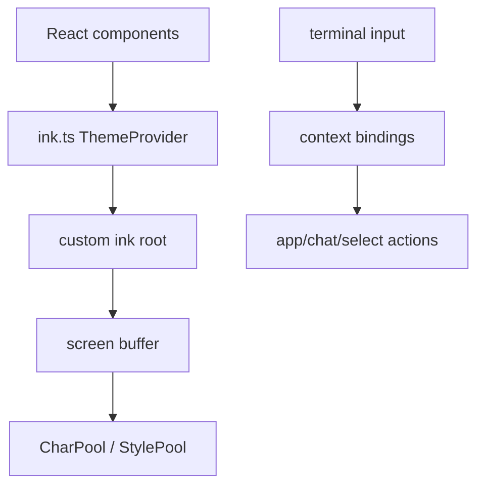

相关源文件

生成本页时使用的主要源文件：

- [src/ink.ts](../../../project-repos/claude-code/src/ink.ts)
- [src/ink/screen.ts](../../../project-repos/claude-code/src/ink/screen.ts)
- [src/keybindings/defaultBindings.ts](../../../project-repos/claude-code/src/keybindings/defaultBindings.ts)
- [src/keybindings/resolver.ts](../../../project-repos/claude-code/src/keybindings/resolver.ts)
- [src/keybindings/parser.ts](../../../project-repos/claude-code/src/keybindings/parser.ts)
- [src/keybindings/loadUserBindings.ts](../../../project-repos/claude-code/src/keybindings/loadUserBindings.ts)
- [src/components/permissions/PermissionRequest.tsx](../../../project-repos/claude-code/src/components/permissions/PermissionRequest.tsx)

# 终端 UI 与键位系统

UI 层的重点不是 React 组件数量，而是终端渲染的约束：字符、ANSI 样式、超链接、选择区域和键盘协议都需要稳定处理。项目把 Ink 包了一层主题系统，并在底层 screen 里做 char/style pool，减少重复字符串和 ANSI transition 计算。

Sources: [src/ink.ts:1-31](../../../project-repos/pages/src/ink.ts#L1-L31), [src/ink.ts:33-85](../../../project-repos/pages/src/ink.ts#L33-L85), [src/ink/screen.ts:15-53](../../../project-repos/pages/src/ink/screen.ts#L15-L53), [src/ink/screen.ts:112-162](../../../project-repos/pages/src/ink/screen.ts#L112-L162)

引用源码

<!-- source-snippets:start -->

#### `src/ink.ts:1-31`

> 未找到引用文件：`src/ink.ts`

#### `src/ink.ts:33-85`

> 未找到引用文件：`src/ink.ts`

#### `src/ink/screen.ts:15-53`

> 未找到引用文件：`src/ink/screen.ts`

#### `src/ink/screen.ts:112-162`

> 未找到引用文件：`src/ink/screen.ts`

<!-- source-snippets:end -->

## 键位系统按上下文解析，用户覆盖后者优先

默认键位按 Global、Chat、Settings、Confirmation、Scroll 等上下文分块。解析时只看当前 active contexts，单键匹配采用“最后一个 wins”，这让用户配置可以覆盖默认绑定。

Sources: [src/keybindings/defaultBindings.ts:32-61](../../../project-repos/pages/src/keybindings/defaultBindings.ts#L32-L61), [src/keybindings/defaultBindings.ts:63-98](../../../project-repos/pages/src/keybindings/defaultBindings.ts#L63-L98), [src/keybindings/defaultBindings.ts:130-188](../../../project-repos/pages/src/keybindings/defaultBindings.ts#L130-L188), [src/keybindings/resolver.ts:22-61](../../../project-repos/pages/src/keybindings/resolver.ts#L22-L61)

引用源码

<!-- source-snippets:start -->

#### `src/keybindings/defaultBindings.ts:32-61`

> 未找到引用文件：`src/keybindings/defaultBindings.ts`

#### `src/keybindings/defaultBindings.ts:63-98`

> 未找到引用文件：`src/keybindings/defaultBindings.ts`

#### `src/keybindings/defaultBindings.ts:130-188`

> 未找到引用文件：`src/keybindings/defaultBindings.ts`

#### `src/keybindings/resolver.ts:22-61`

> 未找到引用文件：`src/keybindings/resolver.ts`

<!-- source-snippets:end -->

## chord 解析避免前缀误吞键

`resolveKeyWithChordState()` 支持 `ctrl+x ctrl+k` 这样的多键 chord。一个非显眼细节是：它先按 chord 字符串聚合 winner，让后来的 null override 可以真正解绑默认 chord，否则 prefix 仍会进入等待状态并吞掉用户想保留的单键绑定。

Sources: [src/keybindings/resolver.ts:79-118](../../../project-repos/pages/src/keybindings/resolver.ts#L79-L118), [src/keybindings/resolver.ts:154-244](../../../project-repos/pages/src/keybindings/resolver.ts#L154-L244)

引用源码

<!-- source-snippets:start -->

#### `src/keybindings/resolver.ts:79-118`

> 未找到引用文件：`src/keybindings/resolver.ts`

#### `src/keybindings/resolver.ts:154-244`

> 未找到引用文件：`src/keybindings/resolver.ts`

<!-- source-snippets:end -->

## Windows/Kitty 协议差异被编码进默认绑定

默认绑定里针对 Windows Terminal VT mode、Bun/Node 版本、Kitty 协议和平台差异选择不同快捷键。例如图片粘贴在 Windows 用 `alt+v`，其他平台用 `ctrl+v`；模式切换在不支持 VT 的 Windows 终端改用 `meta+m`。

Sources: [src/keybindings/defaultBindings.ts:12-30](../../../project-repos/pages/src/keybindings/defaultBindings.ts#L12-L30), [src/keybindings/defaultBindings.ts:50-60](../../../project-repos/pages/src/keybindings/defaultBindings.ts#L50-L60), [src/keybindings/defaultBindings.ts:204-211](../../../project-repos/pages/src/keybindings/defaultBindings.ts#L204-L211)

引用源码

<!-- source-snippets:start -->

#### `src/keybindings/defaultBindings.ts:12-30`

> 未找到引用文件：`src/keybindings/defaultBindings.ts`

#### `src/keybindings/defaultBindings.ts:50-60`

> 未找到引用文件：`src/keybindings/defaultBindings.ts`

#### `src/keybindings/defaultBindings.ts:204-211`

> 未找到引用文件：`src/keybindings/defaultBindings.ts`

<!-- source-snippets:end -->

## 相关页面

- [启动与 CLI 入口](startup-and-cli.md) — CLI 最终挂载 Ink REPL
- [权限与 Hook](permissions-hooks.md) — 权限弹窗是 UI 队列的一部分
- [Agent、Task 与远程会话](agent-task-remote.md) — 任务状态需要在终端中呈现
