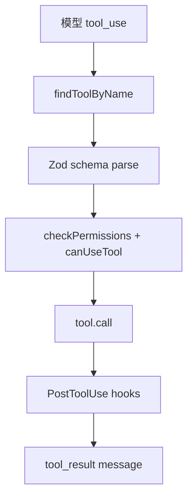
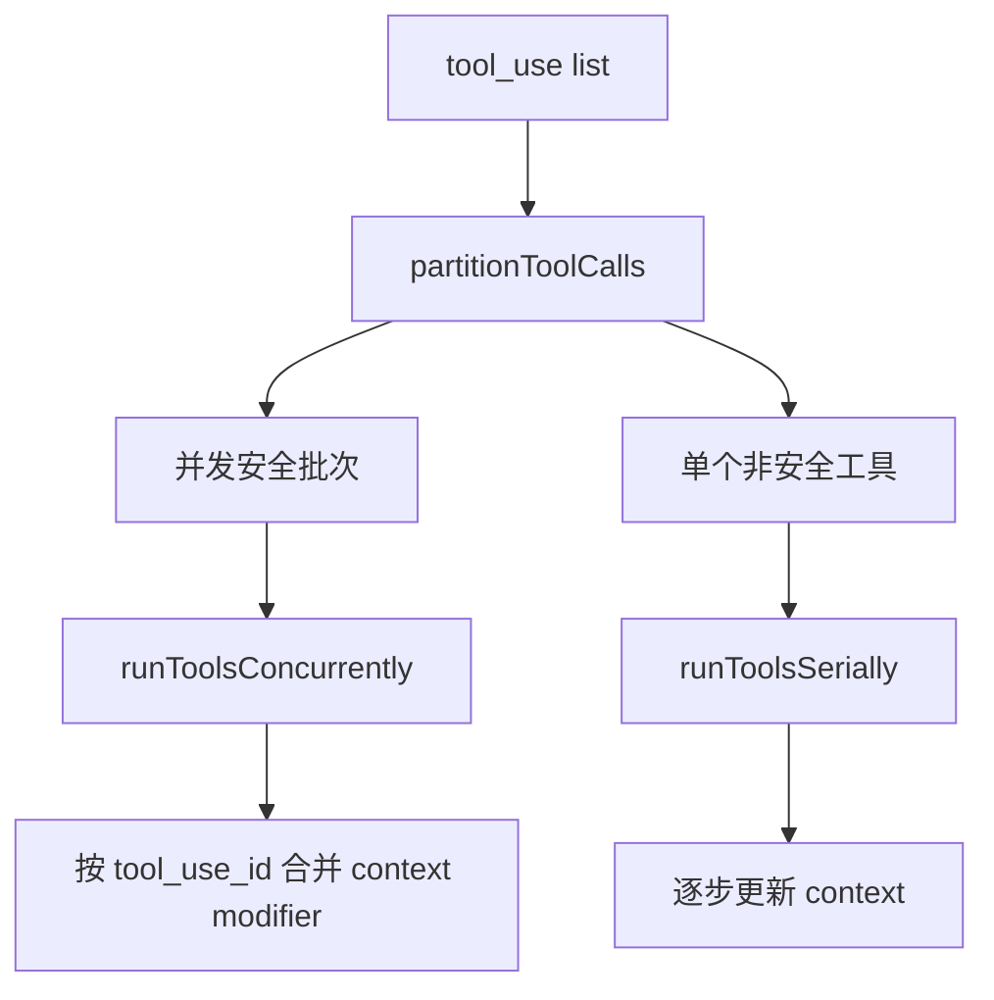

相关源文件

生成本页时使用的主要源文件：

- [src/Tool.ts](../../../project-repos/claude-code/src/Tool.ts)
- [src/tools.ts](../../../project-repos/claude-code/src/tools.ts)
- [src/services/tools/toolOrchestration.ts](../../../project-repos/claude-code/src/services/tools/toolOrchestration.ts)
- [src/services/tools/toolExecution.ts](../../../project-repos/claude-code/src/services/tools/toolExecution.ts)
- [src/tools/BashTool/BashTool.tsx](../../../project-repos/claude-code/src/tools/BashTool/BashTool.tsx)
- [src/tools/FileReadTool/FileReadTool.tsx](../../../project-repos/claude-code/src/tools/FileReadTool/FileReadTool.tsx)
- [src/tools/GrepTool/GrepTool.tsx](../../../project-repos/claude-code/src/tools/GrepTool/GrepTool.tsx)

# 工具系统

工具系统把“模型想做事”变成可验证的 TypeScript 合同。每个 Tool 既有 `inputSchema` 和 `call()`，也必须说明是否并发安全、是否只读、是否破坏性、如何做权限检查、如何生成 prompt 和 UI 名称。这个接口让 Bash、文件编辑、MCP、Agent、Skill 这些差异很大的能力被同一个运行时调度。

Sources: [src/Tool.ts:362-430](../../../project-repos/pages/src/Tool.ts#L362-L430), [src/Tool.ts:495-540](../../../project-repos/pages/src/Tool.ts#L495-L540), [src/Tool.ts:721-792](../../../project-repos/pages/src/Tool.ts#L721-L792)

引用源码

<!-- source-snippets:start -->

#### `src/Tool.ts:362-430`

> 未找到引用文件：`src/Tool.ts`

#### `src/Tool.ts:495-540`

> 未找到引用文件：`src/Tool.ts`

#### `src/Tool.ts:721-792`

> 未找到引用文件：`src/Tool.ts`

<!-- source-snippets:end -->

## 注册表被 feature flag 和环境共同裁剪

`tools.ts` 是内置工具的事实注册表。它用 `feature('...')`、`process.env.USER_TYPE`、运行时 gate 和懒加载组合出最终工具列表；例如搜索工具会因内嵌 bfs/ugrep 存在而省略，LSP 和 worktree 工具也受环境 gate 控制。

Sources: [src/tools.ts:1-53](../../../project-repos/pages/src/tools.ts#L1-L53), [src/tools.ts:158-183](../../../project-repos/pages/src/tools.ts#L158-L183), [src/tools.ts:193-250](../../../project-repos/pages/src/tools.ts#L193-L250)

引用源码

<!-- source-snippets:start -->

#### `src/tools.ts:1-53`

> 未找到引用文件：`src/tools.ts`

#### `src/tools.ts:158-183`

> 未找到引用文件：`src/tools.ts`

#### `src/tools.ts:193-250`

> 未找到引用文件：`src/tools.ts`

<!-- source-snippets:end -->

## 并发调度只给显式声明安全的工具

`runTools()` 会把连续 tool call 分批：并发安全的批次并行执行，非并发安全工具串行执行。这里不是简单判断只读，而是调用工具自己的 `isConcurrencySafe(parsedInput)`；解析失败或判断抛错都会保守地当成不安全。

Sources: [src/services/tools/toolOrchestration.ts:19-82](../../../project-repos/pages/src/services/tools/toolOrchestration.ts#L19-L82), [src/services/tools/toolOrchestration.ts:84-116](../../../project-repos/pages/src/services/tools/toolOrchestration.ts#L84-L116), [src/services/tools/toolOrchestration.ts:118-177](../../../project-repos/pages/src/services/tools/toolOrchestration.ts#L118-L177)

引用源码

<!-- source-snippets:start -->

#### `src/services/tools/toolOrchestration.ts:19-82`

> 未找到引用文件：`src/services/tools/toolOrchestration.ts`

#### `src/services/tools/toolOrchestration.ts:84-116`

> 未找到引用文件：`src/services/tools/toolOrchestration.ts`

#### `src/services/tools/toolOrchestration.ts:118-177`

> 未找到引用文件：`src/services/tools/toolOrchestration.ts`

<!-- source-snippets:end -->

## 执行层对未知工具、取消和 schema 缺失都有明确回路

`runToolUse()` 先在当前可见工具里找，再允许 alias fallback 兼容旧 transcript。找不到工具会生成 `tool_use_error`；输入 schema 错误时还会在 ToolSearch 场景下给模型一个“先加载工具 schema”的提示。这是为长会话和 deferred tools 准备的恢复机制。

Sources: [src/services/tools/toolExecution.ts:337-410](../../../project-repos/pages/src/services/tools/toolExecution.ts#L337-L410), [src/services/tools/toolExecution.ts:572-597](../../../project-repos/pages/src/services/tools/toolExecution.ts#L572-L597), [src/services/tools/toolExecution.ts:599-620](../../../project-repos/pages/src/services/tools/toolExecution.ts#L599-L620)

引用源码

<!-- source-snippets:start -->

#### `src/services/tools/toolExecution.ts:337-410`

> 未找到引用文件：`src/services/tools/toolExecution.ts`

#### `src/services/tools/toolExecution.ts:572-597`

> 未找到引用文件：`src/services/tools/toolExecution.ts`

#### `src/services/tools/toolExecution.ts:599-620`

> 未找到引用文件：`src/services/tools/toolExecution.ts`

<!-- source-snippets:end -->

## 相关页面

- [QueryEngine 会话运行时](query-runtime.md) — 工具调度由 QueryEngine 驱动
- [权限与 Hook](permissions-hooks.md) — 工具执行前后的安全边界
- [Agent、Task 与远程会话](agent-task-remote.md) — AgentTool 是工具系统的一部分
